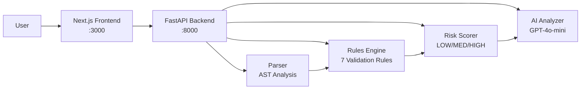

# GenLayer AI Smart Contract Debugger — Walkthrough

## What Was Built

A full-stack developer tool that analyzes GenLayer Intelligent Contracts for structural errors, AI logic quality, consensus risks, and provides improvement suggestions.

---

## Architecture



## Files Created

### Backend (`/backend`)
| File | Purpose |
|------|---------|
| [main.py](file:///c:/Users/badra/OneDrive/Desktop/ASC%20Debugger/backend/main.py) | FastAPI entry point with CORS |
| [parser.py](file:///c:/Users/badra/OneDrive/Desktop/ASC%20Debugger/backend/parser.py) | AST parser — extracts classes, methods, decorators, AI usage, external calls |
| [rules_engine.py](file:///c:/Users/badra/OneDrive/Desktop/ASC%20Debugger/backend/rules_engine.py) | 7 deterministic validation rules (ERROR/WARNING) |
| [risk_scorer.py](file:///c:/Users/badra/OneDrive/Desktop/ASC%20Debugger/backend/risk_scorer.py) | Risk scoring logic (LOW/MEDIUM/HIGH) |
| [ai_analyzer.py](file:///c:/Users/badra/OneDrive/Desktop/ASC%20Debugger/backend/ai_analyzer.py) | OpenAI integration with graceful fallback |
| [api.py](file:///c:/Users/badra/OneDrive/Desktop/ASC%20Debugger/backend/api.py) | `POST /analyze` and `POST /explain` endpoints |

### Frontend (`/frontend/src/app`)
| File | Purpose |
|------|---------|
| [layout.tsx](file:///c:/Users/badra/OneDrive/Desktop/ASC%20Debugger/frontend/src/app/layout.tsx) | Root layout with Inter + JetBrains Mono, dark mode |
| [globals.css](file:///c:/Users/badra/OneDrive/Desktop/ASC%20Debugger/frontend/src/app/globals.css) | Full design system — glassmorphism, animations, risk colors |
| [page.tsx](file:///c:/Users/badra/OneDrive/Desktop/ASC%20Debugger/frontend/src/app/page.tsx) | Main page with editor + results layout |
| [Header.tsx](file:///c:/Users/badra/OneDrive/Desktop/ASC%20Debugger/frontend/src/app/components/Header.tsx) | Branded header with status indicator |
| [CodeEditor.tsx](file:///c:/Users/badra/OneDrive/Desktop/ASC%20Debugger/frontend/src/app/components/CodeEditor.tsx) | Monaco Editor wrapper |
| [ResultsPanel.tsx](file:///c:/Users/badra/OneDrive/Desktop/ASC%20Debugger/frontend/src/app/components/ResultsPanel.tsx) | Results display with loading/error/empty states |
| [RiskBadge.tsx](file:///c:/Users/badra/OneDrive/Desktop/ASC%20Debugger/frontend/src/app/components/RiskBadge.tsx) | Color-coded risk badge |
| [IssueList.tsx](file:///c:/Users/badra/OneDrive/Desktop/ASC%20Debugger/frontend/src/app/components/IssueList.tsx) | Issues/warnings/suggestions lists |
| [SampleContracts.tsx](file:///c:/Users/badra/OneDrive/Desktop/ASC%20Debugger/frontend/src/app/components/SampleContracts.tsx) | 3 sample contracts (LOW/MEDIUM/HIGH) |

---

## Verified Results

### LOW Risk — Simple Storage Contract
````carousel

<!-- slide -->

````

---

## Testing Summary

| Test | Result |
|------|--------|
| Backend `/analyze` — valid contract | ✅ Returns `LOW` risk, parses class/methods/decorators |
| Backend `/analyze` — broken contract | ✅ Returns `HIGH` risk with "No class inheriting from gl.Contract" |
| Frontend loads with Monaco editor | ✅ Dark mode, Python syntax, sample contract preloaded |
| Analyze button → API call | ✅ Loading state + results displayed |
| Sample contract switching | ✅ Editor updates, results clear |
| Risk badge color coding | ✅ Green/LOW, Red/HIGH |
| AI analysis placeholder | ✅ Shows instructions when no API key |
| "Explain This Contract" button | ✅ Visible and wired |

## How to Run

```bash
# Terminal 1 — Backend
cd backend
uvicorn main:app --host 0.0.0.0 --port 8000 --reload

# Terminal 2 — Frontend
cd frontend
npm run dev
```

Open http://localhost:3000 in your browser.

> [!TIP]
> To enable AI-powered analysis, add your OpenAI API key to `backend/.env`:
> ```
> OPENAI_API_KEY=sk-your-key-here
> ```
