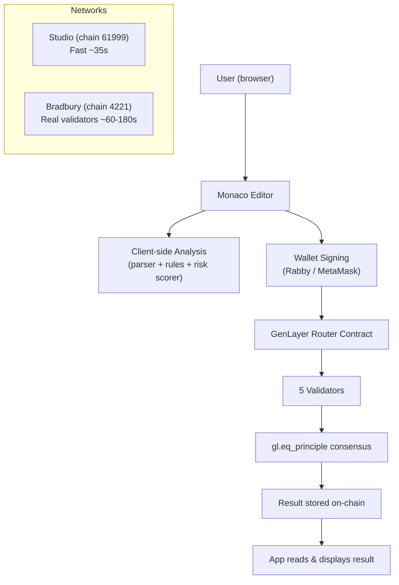

# GLENS — Technical Walkthrough

## Summary

GLENS is a fully on-chain GenLayer Intelligent Contract analyzer. Users paste a Python contract, connect their wallet, and get AI-powered audits verified by real validator consensus. Every analysis is signed by the user's own wallet and executed by 5 independent GenLayer validators — no centralized AI backend.

---

## Architecture



---

## Dual Network Support

| | Studio | Bradbury |
|--|--------|---------|
| Chain ID | 61999 | 4221 |
| Speed | ~35s | 60–180s |
| Purpose | Dev/testing | Production-like |
| Contract | `0xa2c77099...` | `0x4aa1046C...` |
| Wallet | Rabby (chain switch auto-prompted) | Rabby (chain switch auto-prompted) |

The `createWriteClient()` function in `genlayer.ts` handles automatic chain switching — it calls `wallet_switchEthereumChain` before every transaction.

---

## The 4 Actions

### 1. Analyze Contract
- Sends a code summary (≤200 chars) to `analyze_contract()` on the deployed contract
- Validators run the AI prompt and vote on risk level + JSON output
- App polls `client.getTransaction()` every 30s until `FINALIZED` or `ACCEPTED`
- Falls back to client-side heuristic analysis if consensus fails or times out

### 2. Fix & Re-analyze
- Runs `fixGenLayerContract()` locally (deterministic): wraps bare AI calls in `gl.eq_principle`, fixes decorators, adds type annotations
- Then calls `fix_contract()` on-chain for AI suggestions
- UI shows: bullet list of changes + expandable "View fixed code" panel

### 3. Explain
- Calls `explain_contract()` on-chain
- Validators produce a plain-English explanation
- Rendered as clean prose (raw markdown symbols stripped)

### 4. Run Consensus Test
- Sends a deterministic YES-forcing prompt to `simulate_consensus()`
- Validators must ALL return "YES" — tests consensus reachability
- Shows: AGREED ✅ or DISAGREED 🚨 with validator count + duration

---

## Transaction Pipeline

```
writeContract() called
       │
   ┌───┴───┐
   │ success│──────────────────────────────────────────┐
   │ throws │◄── SDK may throw on receipt, that's OK   │
   └───┬───┘                                           │
       │ (on throw)                                    │
   pollForReceipt(evmTxHash)                           │
       │                                               │
   extractGenLayerTxId(receipt)                        │
       │                                               ▼
       └──────────────► pollConsensusStatus(txId)
                                │
                    ┌───────────┴────────────┐
                    │ FINALIZED / ACCEPTED   │ UNDETERMINED /
                    │ → AGREED               │ LEADER_TIMEOUT
                    └───────────────────────┘ → DISAGREED
```

### Why we bypass `waitForTransactionReceipt`
The GenLayer SDK's `waitForTransactionReceipt({ status: TransactionStatus.ACCEPTED })` waits for a specific numeric enum value. Studio validators complete at status `3` (FINALIZED), which the SDK doesn't treat as ACCEPTED — causing a false timeout every time. Our `pollConsensusStatus()` reads `tx.statusName` as a string, correctly handling all terminal states.

---

## Consensus Status Mapping

| SDK statusName | Our mapping | Meaning |
|---------------|-------------|---------|
| `FINALIZED` | AGREED | Validators agreed in first round |
| `ACCEPTED` | AGREED | Validators agreed after appeal rounds (resultName is often empty — this is normal) |
| `UNDETERMINED` | DISAGREED | Max rotations reached, no agreement |
| `LEADER_TIMEOUT` | DISAGREED | Lead validator didn't respond |
| `CANCELED` | CANCELLED | User cancelled |

---

## Security Model

- **No private keys** in the codebase — signing is handled entirely by the user's browser wallet (EIP-1193)
- Client-side analysis is labeled "Static Analysis" and distinguished from on-chain results
- On-chain results are labeled with the network name (Studio / Bradbury)
- The `?debug=1` URL flag reveals the GenLayer Flow Inspector for debugging

---

## Key Files

| File | Role |
|------|------|
| `genlayer.ts` | `createWriteClient`, `pollConsensusStatus`, `ensureWalletNetwork`, network config |
| `analyzer-service.ts` | `analyzeContract`, `simulateConsensus`, `explainContract`, `fixContract` |
| `ResultsPanel.tsx` | Clean results UI: sticky action bar, risk card, issue list, collapsible AI reasoning |
| `SimulationPanel.tsx` | Verdict card: AGREED/DISAGREED with emoji, validator count, duration |
| `ConsensusStatusBar.tsx` | Live spinner + elapsed timer (replaced fake 5-step pipeline) |
| `Header.tsx` | Network selector + wallet connect/disconnect |
| `parser.ts` | AST-style parser: detects classes, methods, decorators, AI usage |
| `rules-engine.ts` | 10+ deterministic rules for structural validation |
| `fixer-engine.ts` | Deterministic fixer: adds `gl.nondet`, wraps `gl.eq_principle`, fixes decorators |

---

## UX Features

| Feature | Implementation |
|---------|---------------|
| **Ctrl+Enter** | Triggers Analyze Contract (keyboard shortcut) |
| **?debug=1** | Reveals GenLayer Flow Inspector (hidden by default) |
| **Human-readable errors** | `transformError()` converts chain errors/rejections to plain English |
| **Expandable fix code** | "View fixed code ↓" toggle in Fix Results |
| **Collapsible AI reasoning** | Collapsed by default, expand to see metrics |
| **Live validator timer** | Shows `Xs elapsed` while waiting for consensus |
| **Dual-network labels** | All results dynamically label "Studio" or "Bradbury" |

---

## What Was Tested

| Test | Result |
|------|--------|
| Studio network connection (chain 61999) | ✅ Auto chain-switch via Rabby |
| Analyze Contract on Studio | ✅ Consensus reached (~35s), result read |
| Run Consensus Test — AGREED | ✅ ACCEPTED status → AGREED (fixed SDK enum bug) |
| Run Consensus Test — DISAGREED | ✅ UNDETERMINED → clear error shown |
| Analyze timeout fallback | ✅ Client-side heuristic used when on-chain fails |
| Fix & Re-analyze | ✅ Bullet list + expandable code diff |
| Keyboard shortcut (Ctrl+Enter) | ✅ Triggers analyze |
| Error messages | ✅ Chain errors shown as plain English |
| ?debug=1 | ✅ Shows GenLayer Flow Inspector |
| Private key scan | ✅ None found |
